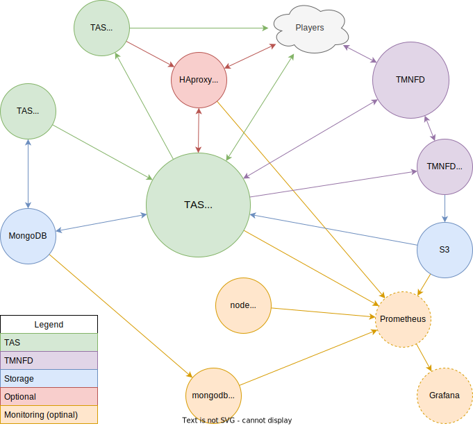

# TMNF-TimeAttackServer

A LAN-Party time-challenge server for Trackmania Nations Forever

## What TMNF-TAS is and how the idea was born

As I am loving Trackmania Nations Forever and got involved in LAN-Partys again, in the recent years, I decided to create this nice little project.

On the [NLPT 2021](https://nlpt.online) event I discovered it's not just me loving TMNF but a lot more people. At the same time it is hard to have all players racing agains eachother at the same time, as there is not just Trackmania been played on a LAN-Party.

But due to Trackmanias nature it is not really neccessary to have all players on one serer at the same time. It came to my mind the easiest solution would be to let everyone hunt for the best laptime whenever they like. A server running the whole time with a given challenge pool, recording every laptime and calculating global points for all players would be nice.

-- and thats exactly what TMNF-TAS is.

After I figured out how to talk to the Dedicated-Server via RPC it was just a matter of a few hours till I had a Python-Daemon that stored all laptimes inside a MongoDB. This technically allready covered all my goals. But then I thougt; a nice little wallboard would be good to have, where the players could see their results via a projector. And after that was done I fell down the rabbithole...  
I added a Challenge-Ticker, a Challenge- and Players-List (both with all recorded data browsable), thumbnail generation, optional dowloadlinks for Challenges and Replays, selectable translation and even a Player-HUD that is capable of letting individual Players follow their live-progress whilst racing... and I guess more, that I just forgot :D

## The technical perspective

Now you know what TMNF-TAS is capable of doing for the users (Players) but you might also be interested in how it's done under the hood.

  * The main component, that orchestrates everything, is **TAS-Backend**. It's written in Python and is the communication hub and central brain of the application. It also exposes an [REST-like API](docs/api-calls.md) through CherryPy and deliveres the compiled Angular TAS-Frontend over the same channel.
  * Than there is the TMNF-Dedicated Server (called **TMNFD** from now on). It's the official challenge server by NADEO. TAS-Backend communicates with TMNFD over it's RPC connection to control the behavior. Mainly I just build a bit of framework around the Dedicated Server and called the whole compontent TMNFD.
  * One part of this framework is **TMNFD-CLI** with it the admin can alter some settings. But it's main purpose is to give TAS-Backend the option to do some shortcuts it wouldn't be able by it's own.
  * TAS got it's own CLI here the focus is the admin. **TAS-CLI** is capable to configure a variety of options and aspects of TAS on-the-fly. The design is that an admin would never need to touch TAS-Backend but instead would use TAS-CLI for this purpose.
  * Then there are the two storage services in form of **MongoDB** and **S3** (MinIO in by default). MongoDB holds everything, configuration and recorded Players data, except binary objects for those S3 is used. Currently this binarys are generated Thumbnails, Challenge Gbx and Player Replays.
  * I'm also including a (optional) setup for a **HAproxy Chache**. During installation it is possible to choose this to be configured. If so, all traffic from TAS-Backend (and -Frontend) is relayed by HAproxy which is setup with it's caching features to minimize the computing load on TAS-Backend and MongoDB.
  * And finally you have the option to enable Prometheus exporters for **monitoring** on all installed components of the TAS-Stack (TAS-Stack describes all components forming the final application/service, or in other words all the earlier named components). The installer includes an option to enable all those exporters, but you have to set up your own Prometheus server (and maybe Grafana) to make use of them.

And now, because a picture says more than 1000 words, here you have a drawing of TAS-Stack's architecture:

## Getting started

At this point I like to hightlight, that TMNF-TAS is not designed to be used on the internet, it's specific target is LAN-Partys and so for local networks.

On my website I prepared a page with some impressions of TMNF-TAS, just follow this link [https://nijos.de/tmnf-timeattackserver/tmnf-tas-impressions/](https://nijos.de/tmnf-timeattackserver/tmnf-tas-impressions/) to reach them.

If you now just like to try out TMNF-TAS, you need to do the following:

  * get an Ubuntu host
  * download the latest release from this GitHub repo
  * make the installer executable
  * execute the installer **as root**
  * follow the steps...

After your done you might type `tas -s` to check if all services of TAS-Stack are running. The frontend should now be available on port 80 (with HAproxy) or port 8000 (without HAproxy).  
And thats just it, your TMNF-TAS instance is ready to be explored.

A lot more detailed installation instructions can be found here: [docs/install.md](docs/install.md) and if you are interested in a configuration guide visit [docs/configuration.md](docs/configuration.md)

And now have fun playing Trackmania Nations Forever ;)

Besides GitHub I'm also reachable on twitter [@nils_ost](https://twitter.com/nils_ost) if you have questions or like to get in touch with me.